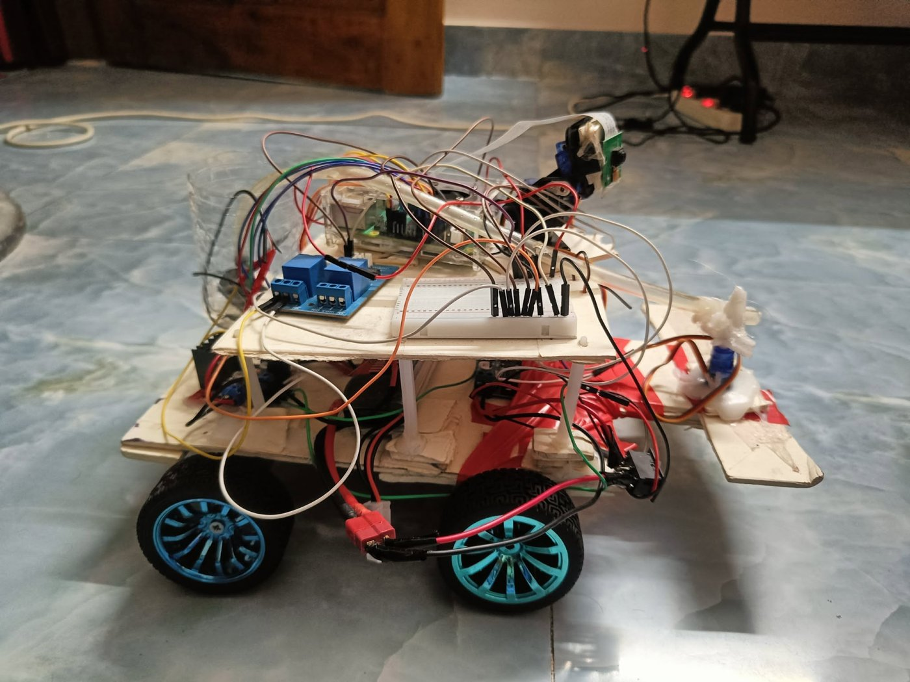
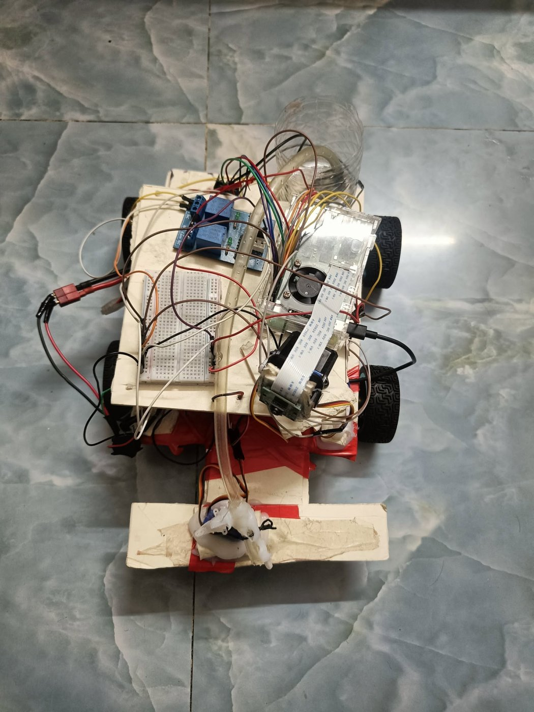
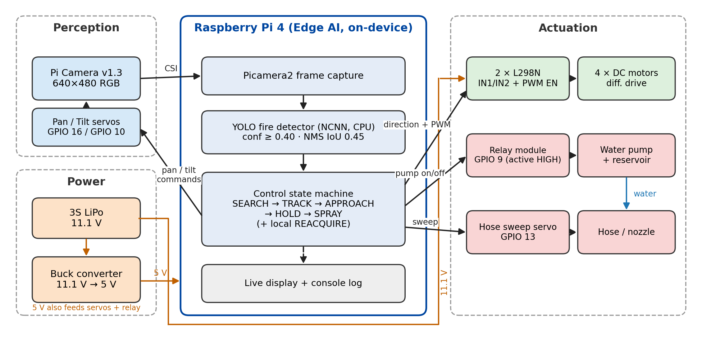
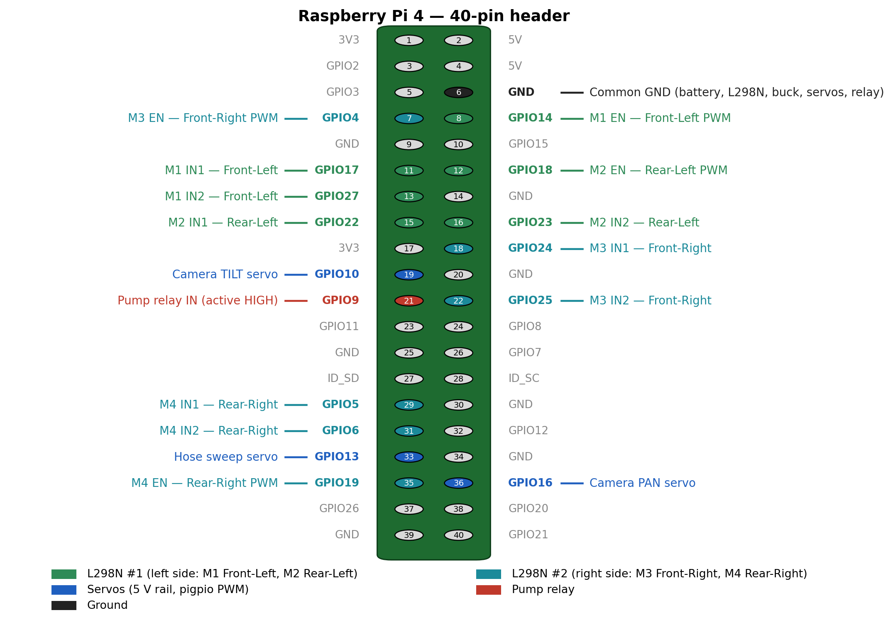
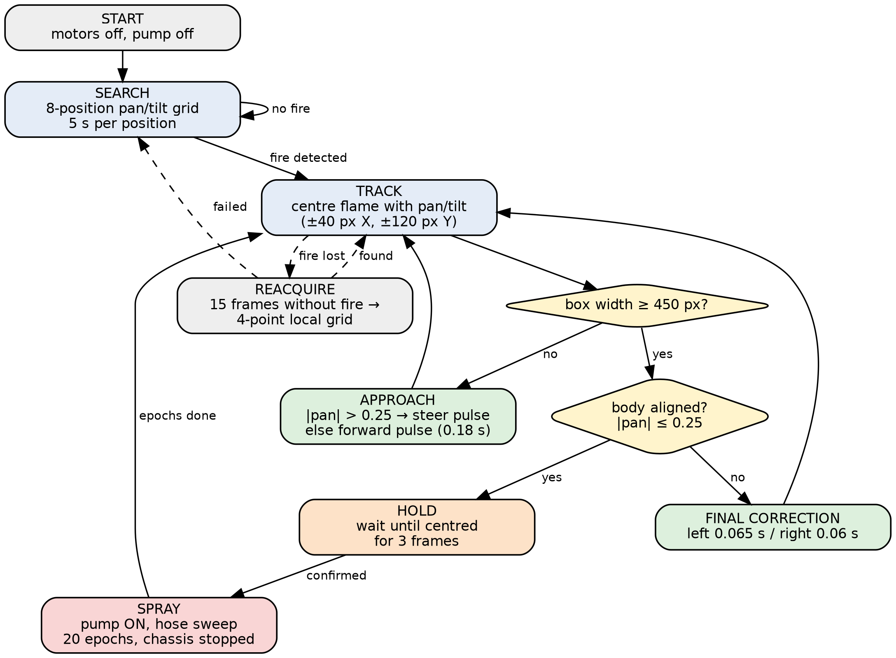
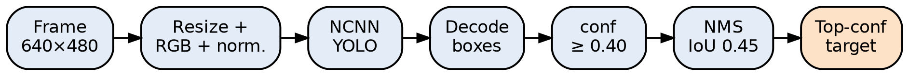
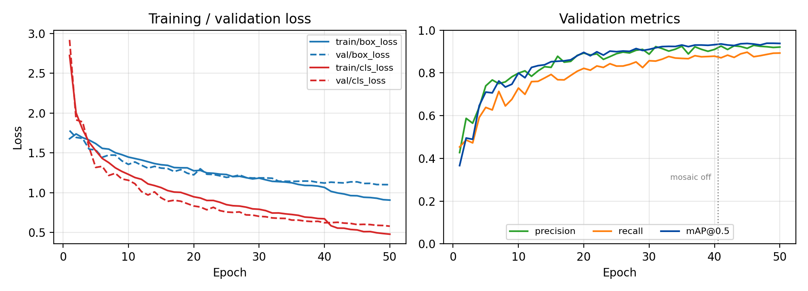
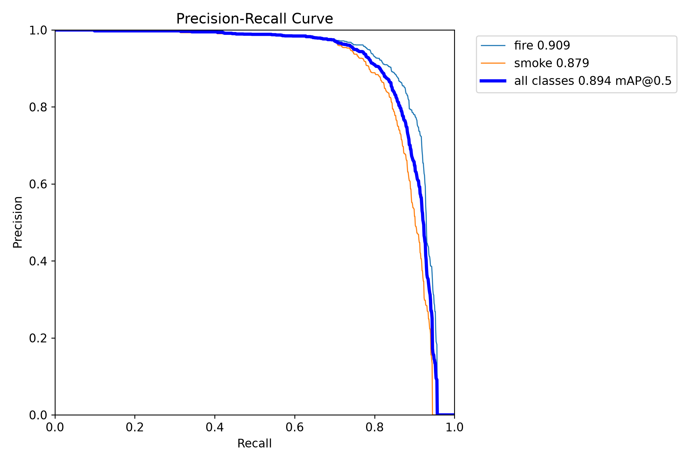
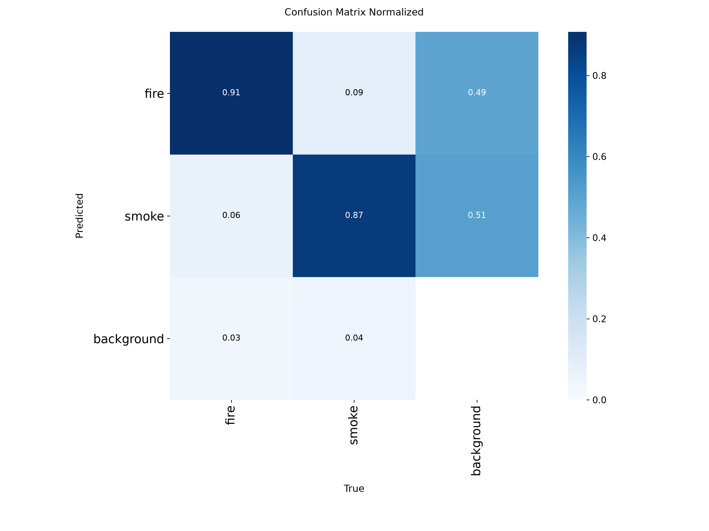
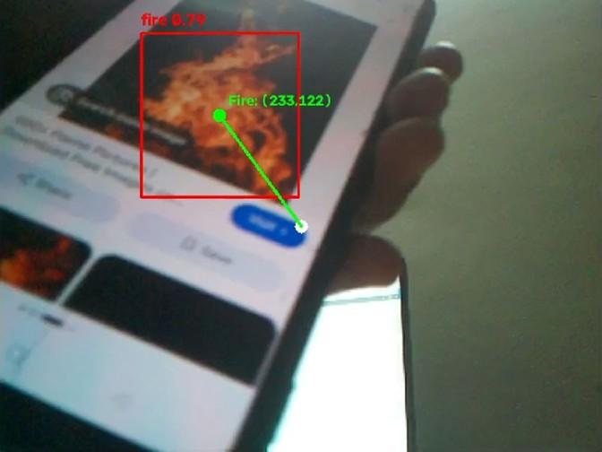

# 🔥 FireBot — Edge AI-Enabled Autonomous Firefighting and Hazard Detection Robot

**CSE 4264 — Internet of Things Lab | Ahsanullah University of Science and Technology (AUST)**
**Group 2, Project 3**

[](https://youtu.be/AtvzNyzKIjw)

FireBot is a **vision-only autonomous ground robot** that detects fire with an on-board YOLO model, tracks it with a pan–tilt camera, drives toward it, and sprays water. All AI inference and control run **on a Raspberry Pi 4**, with **no cloud dependency**.

<p align="center">
  
  
</p>

---

## 📑 Table of Contents
- [Features](#-features)
- [System Architecture](#-system-architecture)
- [Hardware Components](#-hardware-components)
- [Circuit Diagram](#-circuit-diagram--gpio-allocation)
- [How It Works](#-how-it-works)
- [Repository Structure](#-repository-structure)
- [Installation & Setup](#-installation--setup)
- [Usage](#-usage)
- [Results](#-results)
- [Limitations & Future Work](#-limitations--future-work)
- [Team](#-team)
- [Links](#-links)
- [References](#-references)

---

## ✨ Features
- **On-device fire detection:** YOLOv8n fine-tuned on fire and smoke (mAP@0.5 = 0.894 on the test set) and exported to **NCNN** for CPU-only inference on the Pi 4.
- **Autonomous search:** the camera sweeps an 8-position pan/tilt grid, spending 5 s at each position.
- **Visual tracking:** pan/tilt servos keep the flame centred in the frame.
- **Autonomous approach:** the robot steers and drives using short pulses.
- **Vision-only proximity:** the robot treats the fire as close when its bounding box is at least 450 px wide. No ultrasonic sensor is used.
- **Safe spray trigger:** spraying starts only when the fire is close, centred for 3 frames, **and** aligned with the robot's body.
- **Sweeping hose:** a servo sweeps the nozzle during spraying to cover a wider area.
- **Fail-safe:** motors and pump are forced off on any error or on exit.

## 🏗 System Architecture


## 🔧 Hardware Components
| Component | Qty | Purpose |
|---|---|---|
| Raspberry Pi 4 Model B (with fan case) | 1 | Edge AI inference and control |
| Raspberry Pi Camera Module v1.3 | 1 | Fire detection input |
| SG90-type micro servo | 3 | Camera pan, camera tilt, hose sweep |
| L298N dual H-bridge motor driver | 2 | Left-side and right-side motors |
| DC gear motor + wheel | 4 | Four-wheel differential drive |
| Relay module | 1 | Switches the water pump |
| Mini water pump + reservoir + hose | 1 | Fire suppression |
| 3S LiPo battery (11.1 V) | 1 | Main power supply |
| Buck converter (→ 5 V) | 1 | Logic, servo, and relay supply |
| Breadboard, jumper wires | — | Signal and power distribution |

## 🔌 Circuit Diagram & GPIO Allocation


| BCM GPIO | Physical pin | Function |
|---|---|---|
| 16 | 36 | Camera **pan** servo |
| 10 | 19 | Camera **tilt** servo |
| 13 | 33 | **Hose sweep** servo |
| 9 | 21 | **Pump relay** (active HIGH) |
| 17 / 27 | 11 / 13 | M1 IN1/IN2, front-left |
| 22 / 23 | 15 / 16 | M2 IN1/IN2, rear-left |
| 24 / 25 | 18 / 22 | M3 IN1/IN2, front-right |
| 5 / 6 | 29 / 31 | M4 IN1/IN2, rear-right |
| 14 / 18 / 4 / 19 | 8 / 12 / 7 / 35 | PWM enable for M1 / M2 / M3 / M4 (1 kHz) |

**Power:** the 3S LiPo feeds both L298N modules directly. The buck converter's 5 V output powers the Pi, the servos, and the relay. All grounds are connected together.

## ⚙ How It Works


1. **SEARCH:** the camera sweeps the scan grid while the detector runs on every frame.
2. **TRACK:** the robot moves pan/tilt in steps of 0.02 until the flame is within ±40 px horizontally and ±120 px vertically of the frame centre.
3. **APPROACH:**
   - If |pan| > 0.25, the robot turns in place with a 100%-duty pulse (0.065 s left, 0.06 s right).
   - Otherwise it drives forward for 0.18 s.
4. **HOLD:** once the box width is at least 450 px, the robot aligns its body and waits until the flame is centred for 3 consecutive frames.
5. **SPRAY:** the pump turns on for 20 epochs while the hose sweeps. The chassis stays stopped.
6. **REACQUIRE:** if no fire is seen for 15 frames, the camera checks 4 nearby points. If the fire is still not found, the robot goes back to SEARCH.

Detection pipeline:



## 📁 Repository Structure
```
FireBot/
├── README.md
├── requirements.txt
├── LICENSE
├── src/
│   ├── firebot_autonomous.py   # main autonomous controller
│   └── detect.py               # NCNN YOLO inference + NMS
├── models/                     # best.pt + NCNN export
├── tools/                      # calibration & test scripts (+ legacy ultrasonic)
├── hardware/diagrams/          # architecture, GPIO wiring, control loop
├── diagram_src/                # scripts that regenerate the diagrams
└── docs/
    ├── images/                 # robot photos, detection sample, pie chart
    ├── model_eval/             # training curves, PR/F1 curves, confusion matrix
    ├── data/fire_log.csv       # 2,092 on-robot detection events
    └── report/                 # final IEEE report (PDF)
```

## 🚀 Installation & Setup
Use Raspberry Pi OS (64-bit, Bookworm) on a Raspberry Pi 4.
```bash
# 1. Clone
git clone https://github.com/NoobCrow/FireBot.git
cd FireBot

# 2. System packages
sudo apt update
sudo apt install -y python3-picamera2 python3-opencv pigpio python3-pigpio
sudo systemctl enable --now pigpiod        # required for jitter-free servos

# 3. Python packages
pip install -r requirements.txt --break-system-packages

# 4. The trained model is already included in models/best_ncnn_model/
```
Before running, check that the camera is enabled and detected:
```bash
rpicam-hello --list-cameras
```

## ▶ Usage
```bash
cd src
python3 firebot_autonomous.py
```
- Press **`q`** in the preview window, or **Ctrl+C** in the terminal, to stop.
- On exit, the motors and pump are switched off and the GPIO pins are released.

> ⚠️ **Safety:** test only with a small, controlled flame, with an adult present and a fire extinguisher nearby.

## 📊 Results
### Model: YOLOv8n (fire + smoke), 50 epochs, 640×640
**Dataset:** [Home Fire Dataset (Kaggle)](https://www.kaggle.com/datasets/pengbo00/home-fire-dataset), a YOLO-ready dataset for early indoor fire detection with `fire` and `smoke` classes.

| Split | Precision | Recall | mAP@0.5 |
|---|---|---|---|
| Validation | 0.919 | 0.892 | 0.939 |
| Test (all) | ≈0.89 | ≈0.82 | 0.894 |
| Test (fire) | ≈0.92 | ≈0.82 | 0.909 |
| Test (smoke) | ≈0.87 | ≈0.82 | 0.879 |

The test F1 score peaks at 0.85 at confidence 0.41, which is why the robot uses a 0.40 threshold. Test P/R values are read from the curves at confidence 0.41.



<p align="center"> </p>

### On the robot
- 2,092 logged fire detections: mean confidence 0.76, 94% above 0.5
- **30/30 successful end-to-end trials** (search → track → approach → hold → spray, using fire images as targets for safety): 10 each from 1 m, 2 m and 3 m, with the flame at 5 angles (−60°, −30°, 0°, +30°, +60°; 2 trials per angle per distance)

| Start distance | Successful | Time to reach fire |
|---|---|---|
| 1 m | 10/10 | ≈ 1.5 min |
| 2 m | 10/10 | ≈ 2.6 min |
| 3 m | 10/10 | ≈ 3.0 min |

### Configuration
| Parameter | Value |
|---|---|
| Confidence / NMS IoU | 0.40 / 0.45 |
| Close-range trigger | box width ≥ 450 px (of 640) |
| Spray confirmation | 3 centred frames |
| Target-loss limit | 15 frames |
| Inference | Raspberry Pi 4, CPU-only, NCNN |

<p align="center"></p>

The full evaluation is in the [final report](docs/report/), including the model comparison and the unsuccessful configurations we tried (ultrasonic ranging, early pulse timings, and pump pressure).

## ⚠ Limitations & Future Work
- **Distance estimate depends on fire size:** box width grows with both closeness and flame size, so a large fire triggers spraying from farther away. Adding thermal or ToF sensing would give a size-independent range.
- **Weak pump:** the pump works but has limited reach. A higher-pressure pump is needed.
- **Fire class only:** the model detects flames but not smoke. A smoke class is planned.
- **Future improvements:** proportional gimbal control, and IoT alerts that keep inference on the device.

## 👥 Team
| Name | ID | Contribution | Role |
|---|---|---:|---|
| Farhan Labib | 20220104029 | 40% | AI pipeline, detection, tracking and control, integration, testing |
| Ashik Mahmud | 20220104021 | 20% | Model assistance and testing, hardware |
| Prottoy Roy Deep | 20220104099 | 20% | Camera/servo hardware, report |
| Maisha Ahmed | 20220104050 | 20% | Testing, documentation, literature review |

**Course teachers:** Mr. Mustofa Ahmed and Ms. Akila Nipo, Department of CSE, AUST

## 🔗 Links
- 🎥 **Demo video:** https://youtu.be/AtvzNyzKIjw
- 📄 **Report:** [docs/report/](docs/report/)

## 📚 References
1. K. A. P. Perumal et al., "Fire fighter robot with night vision camera," IEEE CSPA, 2019.
2. J. G. Ambafi et al., "Development of a novel IoT-based smart firefighting robot…," CJAST, 2025.
3. D. Yuliawati et al., "AIoT for early fire detection using edge computing and IP camera integration," Teknika, 2024.
4. M. F. S. Titu et al., "Real-time fire detection: Integrating lightweight deep learning models on drones with edge computing," Drones, 2024.
5. J. Lu et al., "FCMI-YOLO: … real-time fire detection on edge devices," PLOS ONE, 2025.

6. PengBo00, "Home fire dataset," Kaggle, 2025. https://www.kaggle.com/datasets/pengbo00/home-fire-dataset

The full reference list is in the report.
